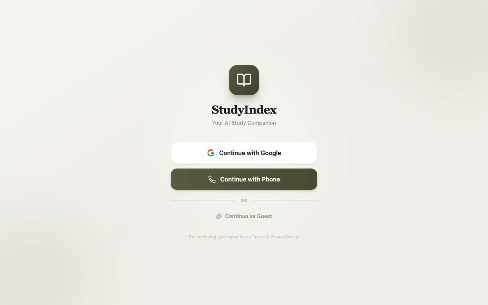
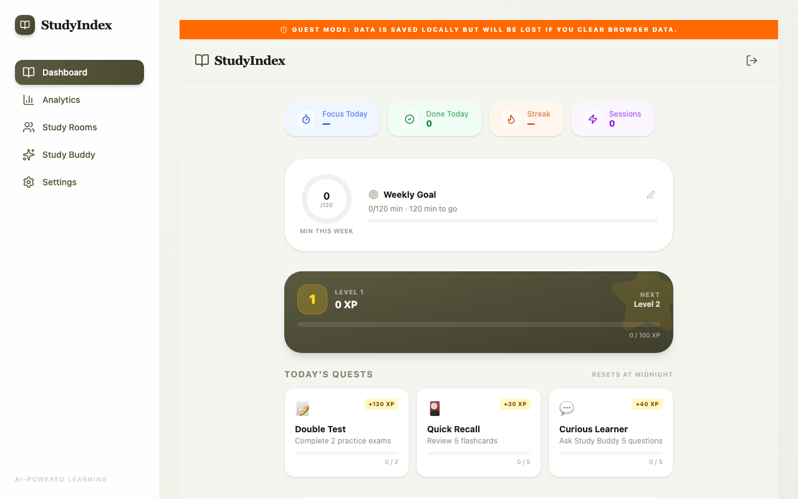
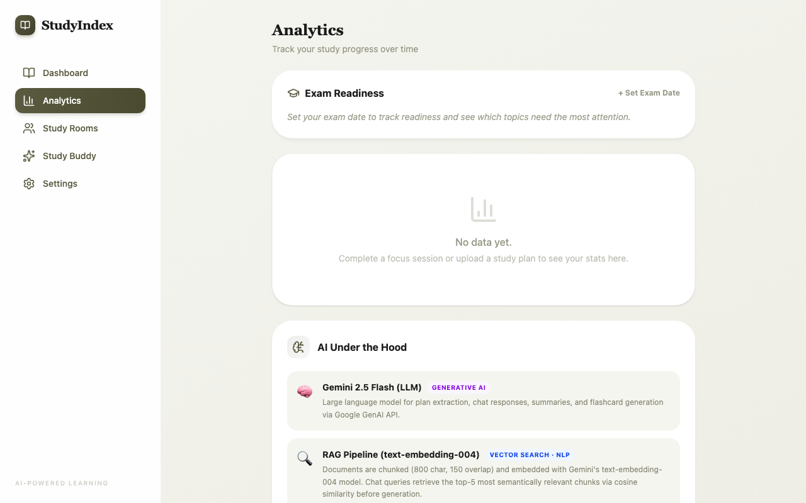
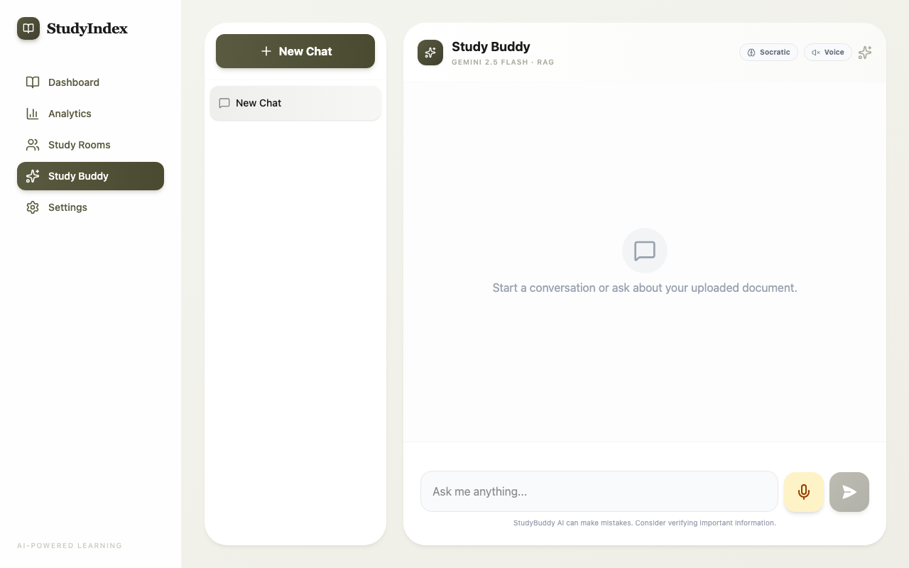
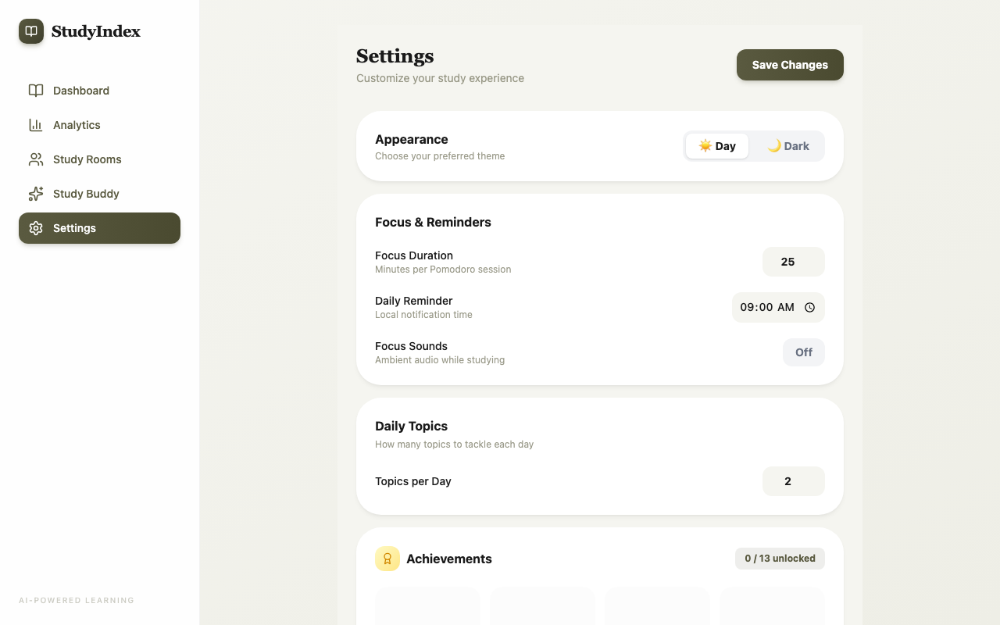
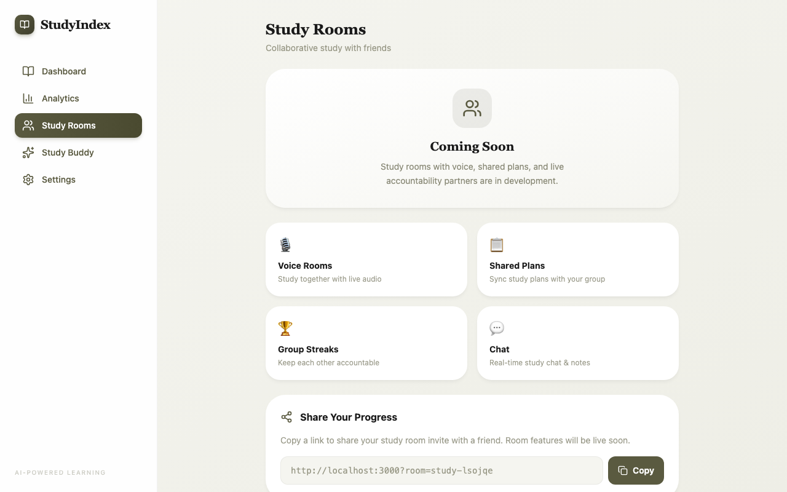

# StudyIndex — AI Study Planner

> An intelligent, adaptive study companion powered by Gemini 2.5 Flash, Retrieval-Augmented Generation, the SuperMemo SM-2 spaced-repetition algorithm, and Ebbinghaus forgetting-curve modelling.

**Live demo:** [studyindex.onrender.com](https://studyindex.onrender.com)  
**GitHub:** [github.com/ethanhunt1011/studyindex](https://github.com/ethanhunt1011/studyindex)

---

## Screenshots

<table>
  <tr>
    <td align="center"><b>Login / Welcome</b></td>
    <td align="center"><b>Dashboard</b></td>
    <td align="center"><b>Analytics</b></td>
  </tr>
  <tr>
    <td></td>
    <td></td>
    <td></td>
  </tr>
  <tr>
    <td align="center"><b>Study Buddy AI Chat</b></td>
    <td align="center"><b>Settings &amp; Achievements</b></td>
    <td align="center"><b>Study Rooms</b></td>
  </tr>
  <tr>
    <td></td>
    <td></td>
    <td></td>
  </tr>
</table>

---

## What it does

StudyIndex turns any study document — a PDF, a scanned image, or a plain text file — into a complete, personalised learning system in seconds. Upload your material once; the app:

1. Extracts a structured study plan (Units → Chapters → Topics) with AI
2. Generates flashcards and schedules reviews using the SM-2 algorithm
3. Answers your questions using Retrieval-Augmented Generation over your document
4. Generates practice exams and grades your short answers with AI
5. Tracks your memory retention mathematically using the Ebbinghaus forgetting curve
6. Predicts how ready you are for your exam based on mastery data

The project sits at the intersection of natural language processing, cognitive science, and educational technology.

---

## User Guide

### Quick Start (2 minutes)

1. **Open the app** → [studyindex.onrender.com](https://studyindex.onrender.com)
2. **Sign in** — Google SSO, phone OTP, or *Continue as Guest* (no account needed)
3. **Upload a document** — PDF, image, or plain text of your study material
4. **Wait ~10 seconds** for the AI to extract your personalised study plan
5. **Start studying** using the Dashboard

---

### Step-by-step walkthrough

#### 1. Uploading a document

On the **Dashboard**, scroll to the *Study Plans* section and click the upload card (or drag-and-drop). The server:
- Extracts text from the file (PDFs are processed page-by-page)
- Asks Gemini to return a JSON study hierarchy (Book → Unit → Chapter → Topic)
- Indexes the document for RAG (embedding every 800-character chunk with `text-embedding-004`)

You will see a "RAG Ready" badge once embeddings are complete (typically 10–30 s).

#### 2. Reviewing flashcards (SM-2)

Click **Review** on any topic card to open the flashcard deck. After seeing the answer, rate yourself 0–5:

| Grade | Meaning | Effect |
|-------|---------|--------|
| 5 | Perfect recall | Interval increases significantly |
| 4 | Correct with slight hesitation | Interval increases |
| 3 | Correct but difficult | Interval increases slightly, EF decreases |
| 0–2 | Incorrect | Interval resets to 1 day |

Orange **"X due"** badges appear on topic cards when reviews are overdue. Use **Drill Mode** (thunder icon in the header) to jump straight to the most overdue topic.

#### 3. Chatting with Study Buddy

Navigate to **Study Buddy**. The AI answers questions using only the content of your uploaded document (RAG), so answers are grounded in your actual material.

- **Socratic mode** — toggle the *Socratic* button to make the AI answer only with leading questions, forcing active recall
- **Voice** — toggle *Voice* to have answers read aloud
- Each conversation is saved; start new ones with **+ New Chat**

#### 4. Taking a practice exam

Click **Practice Exam** on a topic card. The AI generates 4 multiple-choice + 1 short-answer question. After submission:
- MCQs are graded instantly
- The short answer is evaluated by a dedicated AI grader (score 0, 0.5, or 1) with two-sentence feedback

A perfect score (100%) unlocks the **Quiz Hero** achievement and awards bonus XP.

#### 5. Reading AI Study Notes

Click **Study Notes** on any topic card to generate structured notes on demand:
- Concise summary paragraph
- Key-concept definitions (term + definition)
- Worked examples
- Common mistakes to avoid
- A memory tip

#### 6. Tracking your progress

**Analytics** shows:
- **Exam Readiness** — set your exam date; readiness % updates as you study
- **Study Activity Heatmap** — 63-day GitHub-style contribution grid
- **Forgetting Curve** — topics ranked by predicted retention (R = e^{−t/S})
- **AI Under the Hood** — live explanations of every AI component powering the app

#### 7. Gamification

Every action earns **XP**:

| Action | XP |
|--------|-----|
| Review a flashcard | +10 |
| Perfect flashcard review | +15 |
| Complete a practice exam | +30 |
| Pass an exam (≥ 70%) | +50 |
| Perfect exam score | +100 |
| Study Buddy message | +5 |

XP fills the **level bar** (formula: `XP needed = 100 × level²`). Complete **Daily Quests** for bonus XP. Unlock **Achievements** (10+ badges across common → legendary tiers) for milestones like a 7-day streak or 120 minutes studied in a day.

#### 8. Pomodoro Timer

The **Focus Timer** at the top of the Dashboard counts down a 25-minute Pomodoro. In deep-focus mode, the background pulse animation helps maintain attention. Completed sessions add to your weekly minutes goal.

#### 9. Study Rooms

Create or join **Study Rooms** to share a study space with classmates. Rooms show current members and a shared study timer.

#### 10. Settings

- **Profile** — display name, notifications preference
- **Theme** — Light / Dark / Deep Focus
- **Weekly Goal** — set target minutes per week (default 120)
- **Achievements** — view all unlocked and locked badges

---

## Features

### AI-Powered Learning

| Feature | How it works |
|---|---|
| **Study Plan Extraction** | Gemini 2.5 Flash reads the uploaded document and returns a typed JSON hierarchy (Book → Unit → Chapter → Topic) including difficulty, estimated study time, revision schedule, and daily exercises — enforced via a structured response schema |
| **RAG Chat (Study Buddy)** | Documents are chunked into 800-character segments with 150-character overlap, embedded with `text-embedding-004`, and stored. Each user query is embedded and matched against stored chunks via cosine similarity. Only the top-5 semantically relevant chunks are injected into the prompt, reducing hallucination and improving precision |
| **Socratic Mode** | A system-prompt toggle converts the chat model from a direct-answer assistant into a Socratic guide that responds only with leading questions, promoting active recall over passive reading |
| **AI Flashcards + SM-2** | Gemini generates 5 flashcards per topic in structured JSON. Each card is tracked with the SuperMemo SM-2 algorithm: reviews update the ease factor (EF), interval, and repetition count according to the original Wozniak (1987) formula |
| **Practice Exam + AI Grader** | Gemini generates a 5-question exam per topic (4 MCQ + 1 short answer) using a JSON response schema. MCQ is graded instantly. Short answers are evaluated by a dedicated AI grader prompt that returns a score (0, 0.5, or 1) plus two-sentence feedback |
| **AI Study Notes** | On demand, Gemini produces structured study notes per topic: a concise summary, key-concept definitions (term + definition pairs), worked examples, common mistakes, and a memory tip — all returned as validated JSON |
| **Document Summarisation** | Single-click summary of any uploaded file; results are cached server-side |

### Cognitive Science & Analytics

| Feature | Science behind it |
|---|---|
| **Topic Mastery Scoring** | Cumulative SM-2 review outcomes (correct / total) mapped to a 0–100% score, displayed as colour-coded badges on every topic card |
| **Exam Readiness Predictor** | Set an exam date → readiness % = (0.6 × completion%) + (0.4 × avg mastery%). Shows days remaining, weakest topics by mastery score |
| **Forgetting Curve** | Estimated retention per topic using R = e^(−t/S), where t = days since last SM-2 review, S = current interval (stability proxy). Topics sorted by lowest retention first |
| **Knowledge Map** | Collapsible tree visualisation of the full plan hierarchy; dots colour-coded green / yellow / red by mastery, or grey for unstarted |
| **Study Activity Heatmap** | 63-day GitHub-style contribution grid; cell opacity = study minutes / daily maximum |

### Study Tools

- **Pomodoro focus timer** with deep-focus mode (animated liquid fill, ambient pulse)
- **Weekly Goal Tracker** — SVG circular progress ring against a user-set minute target
- **Drill Mode** — detects the topic with the most overdue SM-2 cards and launches a flashcard session automatically
- **Due card badges** — orange "X due" indicator on any topic where SM-2 review is scheduled for today or earlier
- **Scheduled sessions** — add study slots manually or via AI suggestion; Google Calendar export links generated automatically
- **Study streak counter** with badge awards
- **Dark / deep-focus theme**

---

## Architecture overview

```
┌─────────────────────────────────────────────────────────────────────┐
│                          CLIENT (React 19)                          │
│                                                                     │
│  Dashboard ── Flashcards ── StudyBuddy ── Analytics ── Settings    │
│      │              │            │             │                    │
│   SM-2 UI    Practice Exam    RAG Chat   Forgetting Curve           │
└──────────────────────────┬──────────────────────────────────────────┘
                           │ HTTPS / JSON
┌──────────────────────────▼──────────────────────────────────────────┐
│                       EXPRESS SERVER (Node.js)                      │
│                                                                     │
│  /api/upload          store file → async background RAG indexing    │
│  /api/extract-plan    Gemini structured plan extraction             │
│  /api/chat            embed query → cosine search → RAG response    │
│  /api/flashcards      Gemini JSON flashcard generation              │
│  /api/practice-exam   Gemini 5-Q exam with JSON schema              │
│  /api/grade-answer    Gemini short-answer grader (0 / 0.5 / 1)     │
│  /api/study-notes     Gemini structured notes (NLG)                 │
│  /api/summarize       Gemini document summary                       │
│  /api/rag-status/:id  embedding readiness polling                   │
│  /api/health          diagnostic endpoint                           │
└──────────────────────────┬──────────────────────────────────────────┘
                           │ Google GenAI SDK
              ┌────────────▼──────────────┐
              │   Gemini 2.5 Flash (LLM)  │
              │   text-embedding-004      │
              └───────────────────────────┘
```

For a deep technical breakdown of each AI component, see **[ARCHITECTURE.md](./ARCHITECTURE.md)**.

---

## Tech Stack

### Frontend
| | |
|---|---|
| Framework | React 19 + TypeScript |
| Build tool | Vite 6 |
| Styling | Tailwind CSS 4 |
| Animation | Motion (Framer Motion) |
| Routing | React Router 7 |
| Icons | Lucide React |

### Backend
| | |
|---|---|
| Server | Node.js + Express 4 |
| Runtime | `tsx` (TypeScript, no compilation step) |
| AI SDK | `@google/genai` v1.46 |
| LLM | Gemini 2.5 Flash |
| Embeddings | `text-embedding-004` (768-dim) |

### Infrastructure & Storage
| | |
|---|---|
| Auth | Firebase Authentication (Google SSO, Phone OTP) |
| Cloud DB | Firestore (user profiles, cross-device sync) |
| Local storage | Capacitor Preferences (offline-first, all study data) |
| Deployment | Render.com — Oregon region (required for Gemini API) |
| Mobile | Capacitor (Android) |

---

## Getting Started

### Prerequisites
- Node.js 18+
- Gemini API key — [aistudio.google.com/apikey](https://aistudio.google.com/apikey)
- Firebase project with **Authentication** and **Firestore** enabled

### 1. Clone and install

```bash
git clone https://github.com/ethanhunt1011/studyindex.git
cd studyindex
npm install
```

### 2. Environment variables

Create a `.env` file in the root:

```env
VITE_GEMINI_API_KEY=your_gemini_key_here

VITE_FIREBASE_API_KEY=...
VITE_FIREBASE_AUTH_DOMAIN=...
VITE_FIREBASE_PROJECT_ID=...
VITE_FIREBASE_STORAGE_BUCKET=...
VITE_FIREBASE_MESSAGING_SENDER_ID=...
VITE_FIREBASE_APP_ID=...
VITE_FIREBASE_FIRESTORE_ID=...
```

### 3. Run locally

```bash
npm run dev      # Vite + Express on http://localhost:3000
```

### 4. Run tests

```bash
npm test         # run all unit tests (58 tests, ~200ms)
npm run test:watch  # watch mode
npm run test:ui  # visual Vitest UI
```

### 5. Build for production

```bash
npm run build    # outputs to /dist
npm start        # serves /dist via Express
```

### 6. Deploy to Render

The `render.yaml` in the root defines a complete Render service. Connect your GitHub repo, add the environment variables above, and deploy. **You must use the Oregon region** — the Gemini API is not available in all Render regions.

---

## Project Structure

```
studyindex/
├── server.ts                      # Express API server + RAG engine
├── render.yaml                    # Render.com deployment config
├── ARCHITECTURE.md                # Deep-dive technical documentation
├── src/
│   ├── App.tsx                    # Root component, global state, auth
│   ├── components/
│   │   ├── DashboardContent.tsx   # Dashboard, modals (flashcard, exam, notes)
│   │   └── Layout.tsx             # Navigation shell
│   ├── pages/
│   │   ├── index.tsx              # Analytics, StudyBuddy, Settings, Rooms
│   │   ├── Dashboard.tsx          # Dashboard route wrapper
│   │   └── Login.tsx              # Auth screen
│   ├── lib/
│   │   ├── storage.ts             # SM-2, mastery, exam, goal storage layer
│   │   ├── gamification.ts        # XP, levels, achievements, daily quests
│   │   ├── firebase.ts            # Firebase init + auth helpers
│   │   └── utils.ts               # cn() and utility functions
│   ├── services/
│   │   └── gemini.ts              # Shared type definitions
│   └── __tests__/
│       ├── sm2.test.ts            # SM-2 algorithm unit tests (16 tests)
│       └── gamification.test.ts   # Gamification engine tests (42 tests)
└── capacitor.config.ts
```

---

## Testing

The project includes **58 unit tests** covering the core algorithmic layers:

```
src/__tests__/
├── sm2.test.ts          (16 tests) — SM-2 spaced repetition algorithm
│   ├── sm2NewCard — initial state, unique IDs, today's dueDate
│   └── sm2Update — correct/incorrect grades, EF bounds, interval ladder,
│                   non-mutation, output shape
│
└── gamification.test.ts (42 tests) — XP / level / achievement engine
    ├── xpForLevel / levelFromXP — round-trip consistency
    ├── xpProgressInLevel — pct bounds, boundary values
    ├── XP constants — positive, ordering (PERF > PASS > BASE)
    ├── detectNewAchievements — unlock logic, no re-unlock
    ├── ACHIEVEMENTS catalogue — 10+ items, unique IDs, required fields
    ├── generateDailyQuests — determinism, no duplicates, 3 per day
    ├── evaluateQuestProgress — metric mapping, pct capping
    └── initialStats — shape, independence
```

Run with: `npm test` (Vitest, ~200 ms)

---

## Impact Metrics

### Problem scale
Over **350 million students** worldwide prepare for competitive or curriculum exams every year. Traditional study methods (re-reading, highlighting) have an average retention rate of **~30% after one week**. Spaced repetition — the technique behind StudyIndex's SM-2 scheduler — consistently achieves **80–90% retention** in controlled studies (Cepeda et al., 2006).

### What StudyIndex replaces

| Manual task | Time cost | StudyIndex |
|---|---|---|
| Making a study plan from a textbook | 2–3 hours | ~10 seconds (AI extraction) |
| Writing flashcards for a chapter | 30–60 min | ~5 seconds (AI generation) |
| Scheduling review sessions manually | Ongoing | Automatic (SM-2 algorithm) |
| Creating a practice exam | 1–2 hours | ~5 seconds (AI generation) |
| Grading a short-answer question | Manual | Instant (AI grader) |

### API cost analysis (per active user / month)

Gemini 2.5 Flash pricing (as of 2025):

| Operation | Avg tokens | Cost/call | Calls/month | Monthly cost |
|---|---|---|---|---|
| Study plan extraction | ~4 000 | ~$0.0015 | 5 | ~$0.008 |
| Flashcard generation | ~800 | ~$0.0003 | 20 | ~$0.006 |
| RAG chat message | ~2 000 | ~$0.0008 | 50 | ~$0.040 |
| Practice exam | ~1 200 | ~$0.0005 | 10 | ~$0.005 |
| AI study notes | ~1 500 | ~$0.0006 | 15 | ~$0.009 |
| **Total** | | | | **~$0.07/user/month** |

At $0.07/user/month, StudyIndex can serve **~1 400 active users for under $100/month** in AI costs alone — making it economically viable as a free-tier product.

### Technical performance

- **Study plan extraction:** typically completes in 8–15 s for a 10-page PDF
- **RAG embeddings:** ~30 s for a 50-page document (~200 chunks)
- **Chat response latency:** 1.5–3 s (RAG retrieval + Gemini generation)
- **Flashcard generation:** ~2 s per topic
- **Unit test suite:** 58 tests in ~200 ms (Vitest)

---

## AI Techniques Summary

| Technique | Field |
|---|---|
| Gemini 2.5 Flash | Generative AI / LLM |
| RAG with text-embedding-004 | NLP / Vector Search |
| Cosine similarity retrieval | Information Retrieval |
| SM-2 spaced repetition | Cognitive Science |
| Topic mastery scoring | Knowledge Tracing |
| AI practice exam generation | NLG / Assessment |
| Short-answer AI grading | LLM Evaluation |
| Socratic mode | Prompt Engineering |
| AI study notes | Natural Language Generation |
| Ebbinghaus forgetting curve | Cognitive Modelling |
| XP / level gamification | Behavioural Design |
| Achievement + quest system | Engagement Engineering |

---

## Contributing

Contributions are welcome! The codebase is structured so each major feature lives in one file:

| Area | File(s) |
|---|---|
| AI prompts & API routes | `server.ts` |
| SM-2 algorithm | `src/lib/storage.ts` |
| Gamification engine | `src/lib/gamification.ts` |
| Dashboard UI & modals | `src/components/DashboardContent.tsx` |
| Analytics / Chat / Settings | `src/pages/index.tsx` |
| Auth & navigation shell | `src/App.tsx`, `src/components/Layout.tsx` |

**To add a feature:**
1. Fork the repo and create a branch: `git checkout -b feat/your-feature`
2. Write your code + unit tests if you're touching `storage.ts` or `gamification.ts`
3. Run `npm test` — all 58 tests must pass
4. Run `npm run build` — must build without TypeScript errors
5. Open a pull request with a clear description

### Commit history highlights

The project was built incrementally across focused commits:

```
183754b  chore: add vitest + test scripts for unit-test suite
2621c49  test: add gamification engine unit tests (XP, levels, achievements, quests)
2375689  test: add SM-2 spaced repetition algorithm unit tests
ab8e274  fix: rewrite mind-map SVG to eliminate clipping and label overlap
d54281c  style: comprehensive UI polish across all pages
08666c9  feat: gamification, voice study buddy, AI mind maps, share cards
cf4bba7  fix: practice exam short-answer input not rendering
ce05576  docs: add comprehensive README and deep-dive ARCHITECTURE document
820479f  feat: AI Study Notes, Forgetting Curve, Knowledge Map, Weekly Goal rings
55f07c8  feat: Practice Exam, Exam Readiness, Heatmap, Socratic Mode, Drill Mode
```

---

## Security

- The Gemini API key is **never exposed to the browser** — all AI calls are proxied through the Express server
- An in-memory rate limiter enforces 50 requests per minute per IP address
- Firebase credentials are loaded from environment variables at build time via Vite's `define` block
- File uploads are validated server-side; the 50 MB body-parser limit prevents abuse

---

## Licence

MIT
